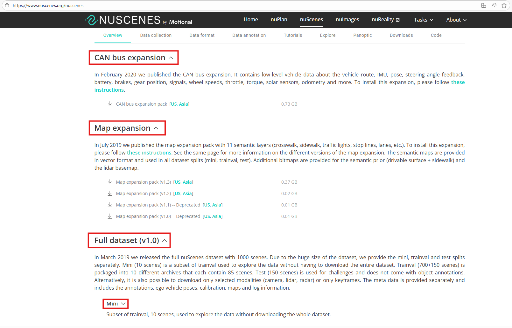

# SSR Demo Guide for A0 Hardware

This document explains how to set up, run SSR-net demo on A0 hardware. It includes demo mode, performance benchmarking, and debugging guides.

## Contents

1. Enable SSR Envinronment

2. Pretrained Parameters and Dataset
   - 2.1 Model Checkpoints and Embeddings
   - 2.2 nuScenes Dataset

3. Demo
   - 3.1 Demo Mode - Run demo with realtime visualization
   - 3.2 Performance Mode - Benchmark TTNN on nuScenes Dataset
   - 3.3 Overriding Default Arguments

Appendices
   - A. Suggested Directory Structure
   - B. Debugging Modes

---

## 1. Enable SSR Envinronment

Move to `tt-metal` root directory, run below command to enable SSR environment.

```bash
source env_set.sh ssr
```

## 2. Pretrained Parameters and Dataset

Data folder contains 3 main subfolders: `ckpts`, `embeddings`, and `dataset` folders.

- `ckpts`: this folder contains SSR model checkpoints
- `embeddings`: this folder contains preprocessed embeddings tensors for SSR.
- `dataset`: this folder contains nuScenes dataset and related data packages.

Follow these steps below to prepare data for SSR demo.

### 2.1 Model Checkpoints and Embeddings

Firstly, merge the separated data files into single data file `data.zip`.
And unzip `data.zip` file which contains model checkpoints, embeddings files and pre-generated annotation files for nuScenes dataset (`mini` version).

```bash
cd $WORKING_DIR
cat data.zip.part-a* > data.zip
unzip data.zip
```

Structure of `data` after unzip `data.zip`:

```
.
|-- ssr # WORKING_DIR
|   |-- data/
|   |   |-- embeddings/
|   |   |   `-- tensor_dict.pth
|   |   |-- ckpts/
|   |   |   |-- ssr_pt.pth
|   |   |   `-- ssr_tt.pth
|   |   |-- vad_nuscenes_infos_temporal_train.pkl
|   |   |-- vad_nuscenes_infos_temporal_val.pkl
```

After this step, we finish preparing `data/ckpts` and `data/embeddings` folders.

### 2.2 **nuScenes Dataset**

In this step, we need to download nuScenes dataset from original source. To download nuScenes dataset, log in [HERE](https://www.nuscenes.org/download) to access nuScenes dataset page. For SSR demo, 3 datasets are required:

- nuScenes v1.0 dataset `mini` version

- CAN bus expansion data

- Map expansion data

The datafolder structure is mentioned in Appendix A.



Firstly, download nuScenes v1.0 dataset `mini` version and CAN bus expansion data to `$WORKING_DIR/data/dataset` folder.

```bash
cd $WORKING_DIR/data && mkdir -p dataset && cd dataset
# Download nuScenes dataset (v1.0) and extract here as nuscenes/
# Download CAN bus expansion data and extract here as can_bus/
```

Then, move to `data/dataset/nuscenes` and download map expansion data

```bash
cd $WORKING_DIR/data/dataset/nuscenes
# Download nuScenes-map-expansion-v1.3.zip and extract; move basemap/ and prediction/ into nuscenes/, and expansion/ into nuscenes/maps/
```

Custom annotations files are provided in `data.zip` already.
- Train: `data/vad_nuscenes_infos_temporal_train.pkl`
- Validation: `data/vad_nuscenes_infos_temporal_val.pkl`

To make it align with the data structure, we need to move it to `data/dataset/nuscenes` folder:

```bash
cd $WORKING_DIR
mv data/vad_nuscenes_infos_temporal_train.pkl data/dataset/nuscenes
mv data/vad_nuscenes_infos_temporal_val.pkl data/dataset/nuscenes
```

> NOTE: these pre-generated files are only for `mini` version of nuScenes dataset.

Final `data` folder is structured as below:
```
.
|-- ssr # WORKING_DIR
|   |-- data/
|   |   |-- embeddings/
|   |   |   `-- tensor_dict.pth
|   |   |-- ckpts/
|   |   |   |-- ssr_pt.pth
|   |   |   `-- ssr_tt.pth
|   |   `-- dataset/
|   |       |-- can_bus/
|   |       `-- nuscenes/
|   |           |-- maps/
|   |           |-- samples/
|   |           |-- sweeps/
|   |           |-- v1.0-mini/
|   |           |-- v1.0-test/
|   |           |-- v1.0-trainval/
|   |           |-- vad_nuscenes_infos_temporal_train.pkl
|   |           `-- vad_nuscenes_infos_temporal_val.pkl
```

Finally, create data symlinks to `ssr/tt` and `ssr/reference` folders.

```bash
# Create symlink
ln -s $WORKING_DIR/data/dataset $WORKING_DIR/tt/data
ln -s $WORKING_DIR/data/dataset $WORKING_DIR/reference/data
```

---


## 3. Demo

Main script: `$WORKING_DIR/scripts/run_ssr_demo.sh`

### 3.1 Demo Mode - Run demo with realtime visualization

This mode runs the end-to-end SSR-Net with real-time visualization. It will continue running indefinitely until interrupted by the user (Ctrl+C).

```bash
bash $WORKING_DIR/scripts/run_ssr_demo.sh demo
```

If you want to include BEV map in visualization output, add `--bev-map` option.

```bash
bash $WORKING_DIR/scripts/run_ssr_demo.sh demo --bev-map
```

> **Note:** BEV map is not supported by SSR-net itself, the BEV map displayed on the screen is retrieved from dataset.

### 3.2 Performance Mode - Benchmark TTNN on nuScenes Dataset

This mode run end-2-end SSR-net without visualization.

```bash
bash $WORKING_DIR/scripts/run_ssr_demo.sh performance
```

### 3.3 Overriding Default Arguments

| Argument | Description | Default |
|----------|-------------|---------|
| `--config` | Path to SSR-net config file | `projects/configs/SSR_e2e.py` |
| `--checkpoint` | Path to model checkpoint file | functional/performance: `$WORKING_DIR/data/ckpts/ssr_tt.pth` ; cpu: `$WORKING_DIR/data/ckpts/ssr_pt.pth` |
| `--embeddings` | Path to embeddings file | `$WORKING_DIR/data/embeddings/tensor_dict.pth` |
| `--launcher` | Launch mode for distributed training/inference | `none` |
| `--eval` | Evaluation metric | `bbox` |
| `--patch` | Path to patch file (functional only) | `$WORKING_DIR/data/dataset/patch.pt` |
| `--visualize` | Enable visualization during inference | False |
| `--repeat` | Repeat inference loop | False |
| `--realtime` | Display visualization in real time (requires `--visualize`). If not set, the output video is saved to `generated/video` | False |
| `--bev_map` | Include BEV (Bird's-Eye View) map in visualization (requires `--visualize`) | False |

**Example:**
```bash
bash $WORKING_DIR/scripts/run_ssr_demo.sh functional \
        --config projects/configs/custom_ssr.py \
        --checkpoint ckpts/custom_ssr.pth \
        --patch patches/patch_v2.pt \
        --visualize --realtime --bev_map
```

---

## Appendices

### A. Suggested Directory Structure

```
.
|-- ssr # WORKING_DIR
|   |-- generated/
|   |-- data/
|   |   |-- embeddings/
|   |   |   `-- tensor_dict.pth
|   |   |-- ckpts/
|   |   |   |-- ssr_pt.pth
|   |   |   `-- ssr_tt.pth
|   |   `-- dataset/
|   |       |-- can_bus/
|   |       `-- nuscenes/
|   |           |-- maps/
|   |           |-- samples/
|   |           |-- sweeps/
|   |           |-- v1.0-mini/
|   |           |-- v1.0-test/
|   |           |-- v1.0-trainval/
|   |           |-- vad_nuscenes_infos_temporal_train.pkl
|   |           `-- vad_nuscenes_infos_temporal_val.pkl
|   |-- reference/
|   |-- tt/
|   |   |-- data@/ -> $WORKING_DIR/data/dataset
|   |   |-- projects/
|   |   |   |-- configs/
|   |   |   `-- mmdet3d_plugin/
|   |   |       |-- SSR/
|   |   |       |   |-- SSR.py
|   |   |       |   |-- SSR_head.py
|   |   |       |   |-- SSR_transformer.py
|   |   |       |   |-- TokenLearner.py
|   |   |       |   |-- modules/
|   |   |       |   |-- planner/
|   |   |       |   `-- utils/
|   |   |-- core/
|   |   |`-- dataset/
|   |   |-- run.py
|   |   `-- pipeline.py
|   |-- test/
|   |-- scripts/
|   |   `-- run_ssr_demo.sh*
|   |-- third_party/
|   |-- requirements.txt
|   `-- README.md
...
```


### B. Debugging Modes

#### Functional Mode - Validate Output (TTNN vs PyTorch Reference)

```bash
bash $WORKING_DIR/scripts/run_ssr_demo.sh functional
```

### C. Tracy profiling

#### E2E profiling - visualize A0 device side

```bash
python -m tracy -r -p -v -m pytest models/bos_model/ssr/test/test_pcc/test_runner.py
```

#### E2E profiling - TTNN-Visualizer

1. Export environment variables using script file, `<experiment-name>` can be anything (e.g. `ssr-e2e`)

```bash
export EXPERIMENT_NAME=<experiment-name>
source models/bos_model/export_l1_vis.sh $EXPERIMENT_NAME
```

2. Run model

```bash
pytest models/bos_model/ssr/test/test_pcc/test_runner.py
```

If the model has finished running successfully, the result report will be generated in the following path (`generated/ttnn/reports/$EXPERIMENT_NAME_MMDD_hhmm/`)

3. Third, run ttnn-visualizer and see results

```bash
ttnn-visualizer --profiler-path $REPORT_PATH
```

`$REPORT_PATH` is the path mentioned in the previous step, visit http://localhost:8000/ using your web-browser

If the experiment has finished, please run the following command to clear the environment variables

```bash
source models/bos_model/unset_l1_vis.sh
```

#### CPU Mode - Run PyTorch Baseline

```bash
bash $WORKING_DIR/scripts/run_ssr_demo.sh cpu
```
